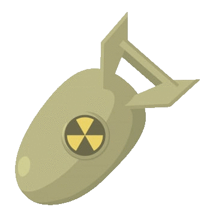

# Project Space Chasing Game

---

## About this project
In this game, player has to control the player's spaceship to dodge enemy ships that are chasing the player.
Which during the game will have item drops for player to collect. If player collides with enemy it will make the game over.
After that the game will show top 5 scoreboard and update score into the `scoredata.json` file

***
## Project overview and features
The main program will ask user for player name which will be collected with player score in `scoredata.json`
### Main features
* User can control player spaceship by using arrow keys
* Score is count by seconds -every 1 second = 1 score-
* Enemy spaceships with chasing player
* Enemy will spawn every 10 seconds, and it's speed also increase
* Player can collect item
* item "Nuke" will clear all enemy 
* item "Ender pearl" will teleport player to anywhere on the screen 
* Scoreboard with top 5 high score
* ester egg

***
## Requirement
### Module
* `turtle`
* `os`
* `json`
* `time`
* `random`

please download font `Consolas` into your computer.

***
## Program design
### [Project UML class diagram here](Class_diagram_space_chasing.png)
There are 11 classes
* `Character`: This class for creating character object.
* `Player`: This class for create and control player.
* `Enemy`: This class for create enemy and chase player.
* `WriteScreen`: This class for screen writer.
* `Item`: This class for create item and check that player collect item or not.
* `Score`: this class for creating and sorting a score database file.
* `GameScreen`: This class for creating screen
* `Border`: This class for create a border surrounding map
* `RunScreen`: This class for use of all the modules above and combine all functions to run entire game. 
* `Nuke`: This class for create nuke item
* `EnderPearl`: This class for create ender pearl item

***
## Code structure
My application have 6(+1) main file which are `character.py`, `scoreboard.py`,
`screen.py`, `item.py`, `secret.json`, `app.py`, `scoredata.json`

### 1.`character.py`
This module contains `Character` class,`Player` class that is a subclass of `Character`, 
`Enemy` class that is a subclass of `Character`, `WriteScreen` class that is a subclass of `Character` and 
`Item` class that is a subclass of `Character`.

### 2.`scoreboard.py`
This module contains the `Score` class.

### 3.`screen.py`
This module contains `GameScreen` class,`Border` class that is a subclass of `GameScreen`, 
`RunScreen` class that is a subclass of `GameScreen`. 

### 4.`item.py`
This module contains `Nuke` class that is a subclass of `Item` class from `character.py` and 
`EnderPearl` class that is a subclass of `Item` class.

### 5.`secret.json`
json file for collecting ester egg data

### 6.`app.py`
This module implements an application that demonstrates the use of screen modules.

### 7.`scoredata.json`
json file for collecting player score from `scoreboard.py`

-This file auto generate by `scoreboard.py`- 

;)
